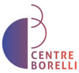
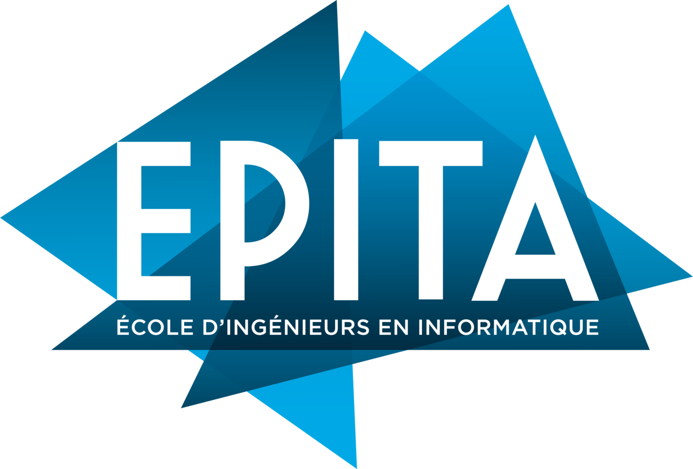

# Welcome to the webpage of the ANR Apate project
**A Prototype deepfake Assessment Toolbox for forensic Experts — APATE**

On this page, you will find information about the project and participating teams.

# Project summary

The rise in the manipulation of images and voice represents a potential threat for crimes including disinformation campaigns, security fraud, extortion, online crimes against children, crypto jacking or illicit markets. Deepfake techniques are openly described and widely available; generating deepfakes is easy, and their quality has considerably improved. Therefore, it is challenging to detect them by mere visual analysis. As a consequence, there is an increasing need for deepfake detection tools. While several methods achieve good error rates under controlled scenarios, no dedicated tools are available for criminalistics experts. The goal of APATE is to deliver state-of-the-art methods to detect deepfakes. Instead of a “one size fits all” tool, the project aims at providing a toolbox of complementary techniques, based on the audio or visual parts of the video, by exploiting either low-level or semantic information, or by combining them in a multimodal manner. Each tool will address a different family of deepfakes, and will come with documentation detailing the use-cases, the known bias, the validation framework and how the results can be interpreted. The consortium includes criminalistics experts from the French National Scientific Police Service (SNPS), ensuring that the proposed toolbox is usable, properly described, and processes efficiently actual deepfakes found in criminal cases. In addition, the literature on deepfake generation will be continuously reviewed and analysed, to ensure that datasets corresponding to the latest deepfake generation techniques are available for the partners; a special concern will be to avoid overfitting to the learning databases. The consortium includes three research laboratories (Centre Borelli at ENS Paris Saclay, EPITA, LIX at Ecole Polytechnique), the SNPS, and IDEMIA, world leader in biometric recognition.

* Project ANR-22-CE39-0016 ([Link](https://anr.fr/Project-ANR-22-CE39-0016), [French summary](https://anr.fr/fr/projets-finances-et-impact/projets-finances/projet/funded/project/anr-22-ce39-0016/?tx_anrprojects_funded%5Bcontroller%5D=Funded&cHash=14ef2e47bc0eb7145e5bb82c7ecf0c3d))
* 36 months, starting on September 2022
* ANR funding: € 559679
* Selected by the scientific evaluation committee CES39: _Sécurité globale, cybersécurité, résilience et gestion de crise_
* Coordination: Centre Borelli, École Normale Supérieure Paris-Saclay

# Partners

<figure><figcaption><a href="https://centreborelli.ens-paris-saclay.fr">Centre Borelli</a>, École Normale Supérieure Paris-Saclay</figcaption></figure>

<figure><figcaption><a href="https://www.idemia.com/">IDEMIA</a></figcaption></figure>

<figure><figcaption><a href="https://www.police-nationale.interieur.gouv.fr/nous-decouvrir/notre-organisation/organisation/service-national-de-police-scientifique-snps">SNPS</a>, Service National de Police Scientifique (French Scientific Police)</figcaption></figure>

<figure><figcaption><a href="https://www.epita.fr/">EPITA</a>, École pour l'informatique et les techniques avancées</figcaption></figure>

<figure><figcaption><a href="https://www.lix.polytechnique.fr/">LIX</a>, École Polytechnique</figcaption></figure>

# Publications

<iframe
id="publicationshal"
title="Publications"
width="100%"
height="2500"
src="https://api.archives-ouvertes.fr/search/anr/?omitHeader=true&wt=html&q=%2A&sort=publicationDate_tdate+desc&fq=collCode_s%3AANR&fq=NOT+status_i%3A111&fq=%7B%21tag%3Dtag0__anrProjectReference_s%7DanrProjectReference_s%3A%28%22ANR%5C-22%5C-CE39%5C-0016%22%29&defType=edismax&rows=1000">
style="border: 0"
</iframe>